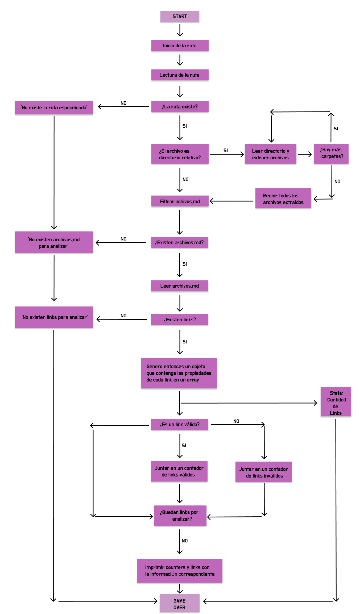
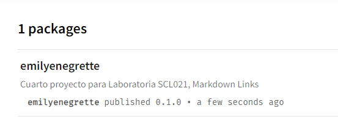
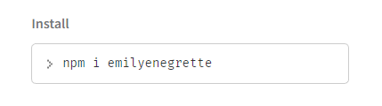
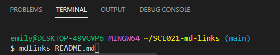
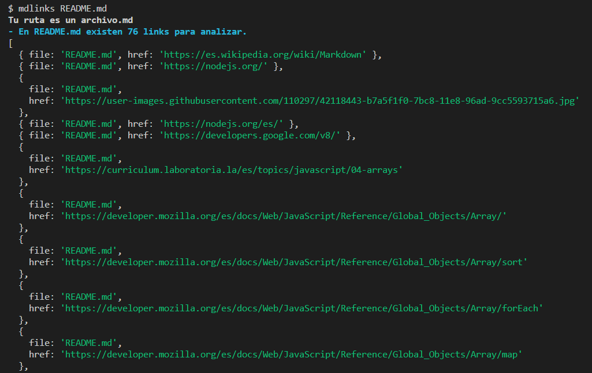
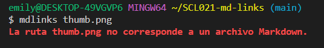
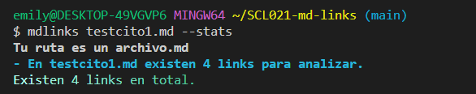
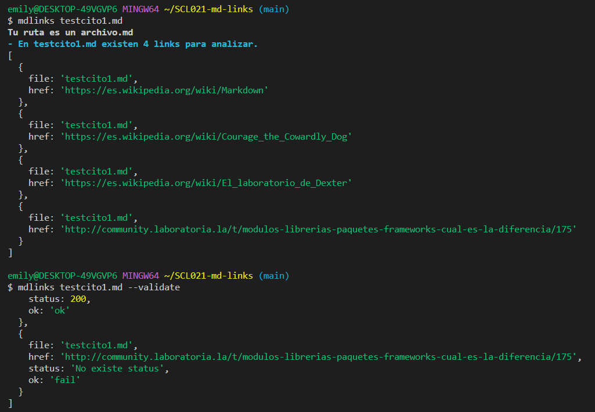

# Markdown Links 🔗

## Índice 🖤

* [1. Descripción](#1-Descripción)
* [2. Diagrama de Flujo](#2-Diagrama-de-flujo)
* [3. Instalación](#3-Instalación)
* [4. Ejemplos](#4-Ejemplos)

## 1. Descripción ©️

Markdown Links es una librería creada con Node.Js y disponible en npm para instalar. En ella podrás validar links válidos y rotos, reconocer si hay algún archivo.md y cuando es otro tipo de archivo, y del mismo modo poder contabilizar cuantos links hay y sus respectivos status. 

## 2. Diagrama de Flujo 🌐

Para desarrollar este proyecto se utilizó este diagrama de flujo: 

## 3. Instalación 🌎💙

Para instalar la librería:

## 4. Ejemplos 👩‍💻

  Lo primero que hacemos es analizar los archivos utilizando la palabra mdlinks como se muestra en la imagen:

Al escanearlo nos muestra que efectivamente es un archivo MD y cuantos links contiene el archivo con el directorio donde estan contenidos, en este caso README.MD: 

El siguiente ejemplo es utilizando una imagen como ejemplo en la cual nos esta arrojando que no corresponde a un archivo MD porque es una imagen:

Al testear los stats nos indica cuantos links hay en total en el archivo que escaneamos: 

Y por ultimo, al validar los elementos nos indica si es que hay algun link roto o si todos los links estan funcionando correctamente: 
 

